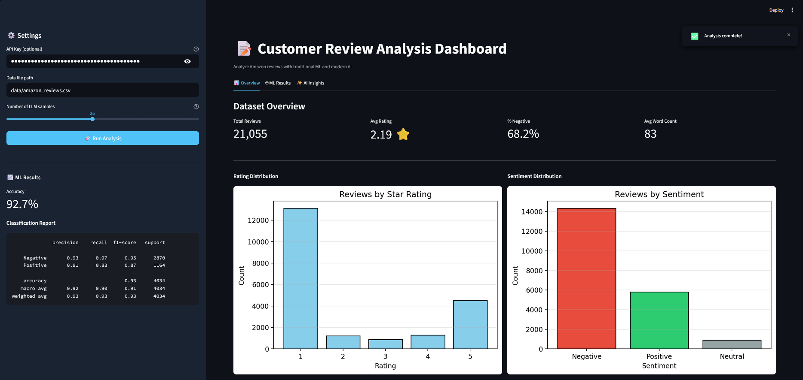
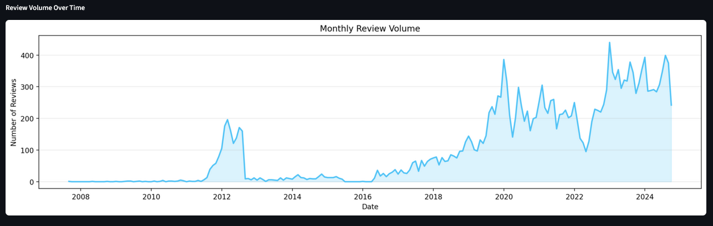
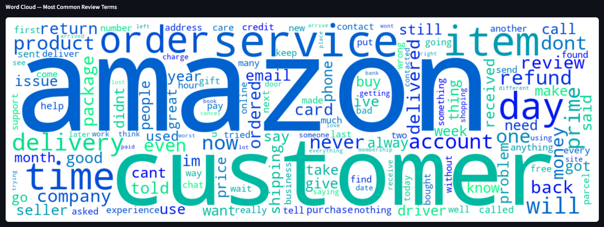
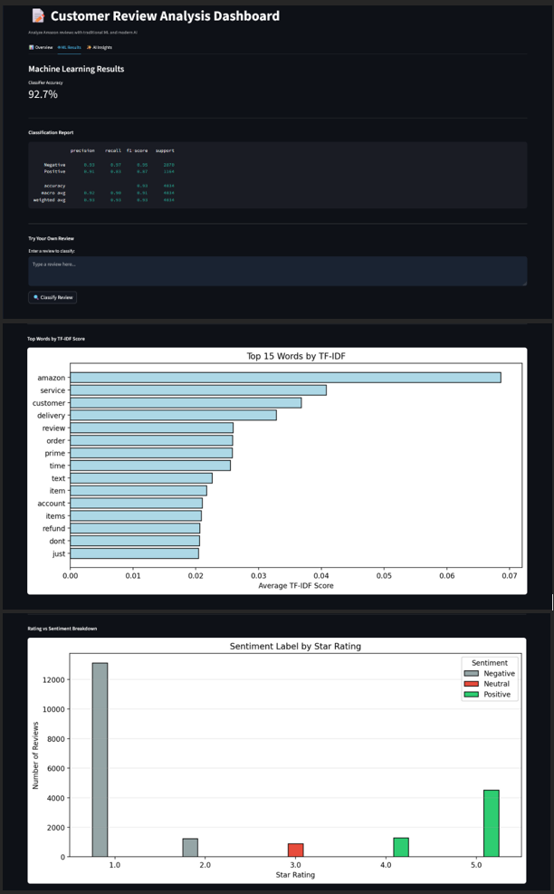
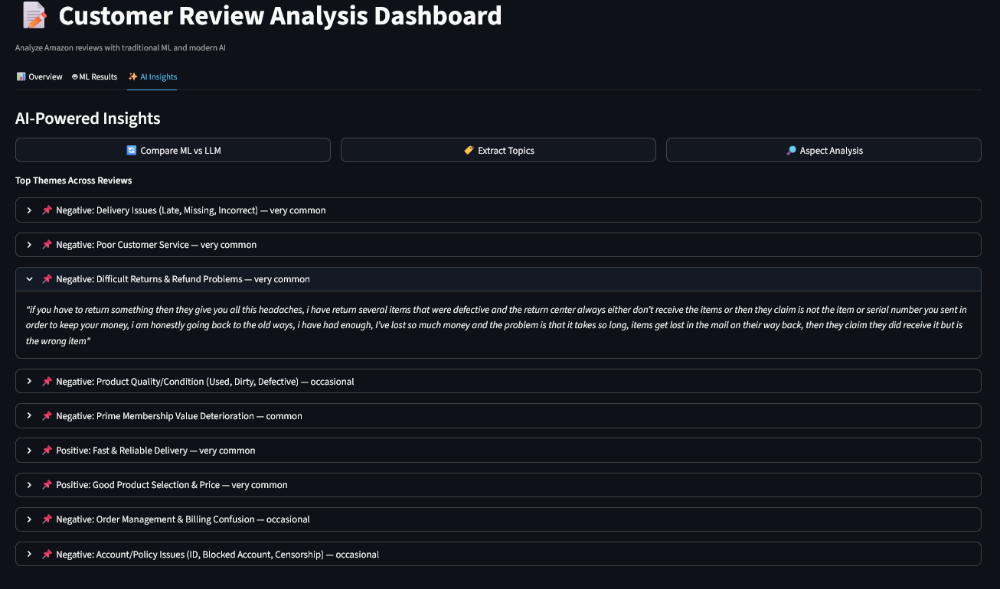
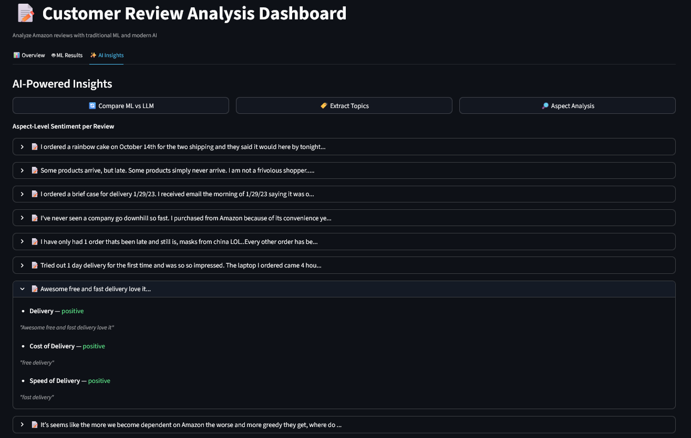

# Customer Review Analysis — NLP with Traditional ML and Modern AI
 
An end-to-end review analysis pipeline that processes 21,000+ real Amazon reviews using both traditional machine learning (TF-IDF + Logistic Regression) and modern AI (Google Gemini zero-shot classification, aspect extraction, and topic modeling) — wrapped in an interactive Streamlit dashboard.
 
Built with Python, scikit-learn, Streamlit, and Google Gemini.
 
---
 
## What It Does
 
```
Raw Reviews  →  Clean  →  TF-IDF Features  →  Logistic Regression  →  Sentiment Labels
                                                                               ↓
                                                            Gemini  →  Aspects + Topics
```
 
Each review is cleaned and vectorized into TF-IDF features, then a Logistic Regression classifier predicts sentiment (Positive/Negative). In parallel, Gemini performs zero-shot classification on the same reviews and extracts aspect-level sentiments and recurring themes — enabling a direct comparison of both approaches.
 
---
 
## Features
 
- **Text Preprocessing** — Lowercasing, punctuation removal, whitespace normalization, and word count tracking
- **TF-IDF Vectorization** — Converts review text into a 2,000-feature sparse matrix with English stopwords removed
- **Sentiment Classification** — Logistic Regression trained on labeled reviews achieves 92.5% accuracy on 21,000+ real-world reviews
- **Zero-Shot LLM Classification** — Gemini classifies sentiment with no training data, enabling direct ML vs LLM comparison
- **Aspect Extraction** — Gemini identifies product features mentioned in reviews and classifies each as positive, negative, or neutral
- **Topic Modeling** — Gemini surfaces recurring themes across review samples with frequency hints and example quotes
- **Streamlit Dashboard** — Three-tab interface: Dataset Overview, ML Results, and AI Insights
- **Word Cloud** — Visual summary of the most common terms across all reviews
- **Time Series** — Monthly review volume chart showing submission trends over time
- **Rating vs Sentiment Breakdown** — Cross-tab showing how star ratings map to ML sentiment predictions
- **Custom Review Classifier** — Enter any review text and get an instant ML sentiment prediction
---
 
## Tech Stack
 
| Layer | Technology |
|-------|-----------|
| Frontend | Streamlit |
| Machine Learning | scikit-learn (TfidfVectorizer, LogisticRegression, train_test_split) |
| AI Analysis | Google Gemini (gemini-2.5-flash) |
| Data Processing | pandas, NumPy |
| Visualization | matplotlib, WordCloud |
| Environment | python-dotenv |
 
---
 
## The Dataset
 
21,000+ real Amazon customer reviews from Trustpilot:
 
| Column | Description |
|--------|-------------|
| `review_id` | Unique review identifier |
| `reviewer_name` | Reviewer display name |
| `country` | Reviewer country (US, GB, CA, IN, etc.) |
| `review_date` | Date review was posted |
| `rating` | Star rating (1–5) |
| `review_title` | Short review headline |
| `review_text` | Full review text |
| `date_of_experience` | Date of the experience reviewed |
 
The dataset skews heavily negative (avg rating: 2.2) — customers are more motivated to write reviews when unhappy. This real-world imbalance makes the classification task more challenging and the insights more interesting.
 
---
 
## Project Structure
 
```
customer-review-analysis/
├── review_analyzer.py   ← Full NLP pipeline: clean, TF-IDF, classify, LLM analysis
├── review_app.py        ← Streamlit dashboard
├── Project_4_Customer_Review_Analysis.ipynb  ← Analysis walkthrough and reflection
├── requirements.txt     ← Project dependencies
├── .env.example         ← Environment variable template
├── .env                 ← API keys (not committed)
├── .gitignore
│
├── data/
│   └── amazon_reviews.csv   ← 21,000+ real Amazon reviews
│
└── .streamlit/
    └── config.toml      ← Custom dark theme configuration
```
 
---
 
## Getting Started
 
### 1. Clone the Repository
 
```bash
git clone https://github.com/Drizztovski/customer-review-analysis.git
cd customer-review-analysis
```
 
### 2. Install Dependencies
 
```bash
pip install -r requirements.txt
```
 
### 3. Configure API Key (optional — only needed for AI features)
 
```bash
cp .env.example .env
```
 
Open `.env` and add your key:
 
```env
GOOGLE_API_KEY=your_gemini_api_key_here
```
 
Get a free key at [aistudio.google.com/apikey](https://aistudio.google.com/apikey). The app runs fully without it — zero-shot classification, aspect extraction, and topic modeling are the only features that require a key.
 
### 4. Run the App
 
```bash
streamlit run review_app.py
```
 
Opens at `http://localhost:8501`
 
---
 
## How It Works
 
### The Analysis Engine (`review_analyzer.py`)
 
1. **Data Cleaning** — Loads the CSV, drops rows with missing review text or ratings, strips whitespace from string columns, and parses review dates as datetime.
2. **Text Preprocessing** — Converts to lowercase, removes punctuation and special characters, normalizes whitespace, adds word count per review, and maps star ratings to sentiment labels (1–2 = Negative, 3 = Neutral, 4–5 = Positive).
3. **TF-IDF Vectorization** — Fits a TfidfVectorizer with 2,000 features and English stopwords removed on the training set. Words that appear frequently in one review but rarely across all reviews get higher scores — making the signal more meaningful than simple word counts.
4. **Sentiment Classification** — Trains a Logistic Regression classifier on binary sentiment (Positive/Negative only — Neutral reviews excluded for cleaner signal). Achieves 92.5% accuracy on the held-out test set.
5. **Zero-Shot LLM Classification** — Sends each review to Gemini with a single prompt asking for a Positive/Negative/Neutral label. No training data required — the model infers from context.
6. **Aspect Extraction** — Prompts Gemini to identify product features or topics mentioned in a review and classify each as positive, negative, or neutral. Returns structured JSON parsed into a list of dicts.
7. **Topic Modeling** — Sends a batch of reviews to Gemini and asks it to surface recurring themes with frequency hints and example quotes.
---
 
## Key Technical Decisions
 
**Binary classification over three-class** — Neutral (3-star) reviews are excluded from ML training. Three-star reviews are genuinely ambiguous — they typically contain both positive and negative language — so including them as a third class degrades model performance without adding useful signal.
 
**TF-IDF over raw counts** — Raw word counts treat every occurrence equally. TF-IDF penalizes common words that appear across all reviews (like "Amazon", "order", "delivery") and rewards words that are distinctive to specific reviews — giving the classifier more meaningful features to work with.
 
**JSON stripping for LLM responses** — Gemini occasionally wraps JSON responses in markdown fences (` ```json `) despite being explicitly told not to. The engine strips these with a regex before parsing to avoid silent failures.
 
**Zero-shot vs trained — when each wins** — The ML classifier is fast, deterministic, and cheap at scale. Gemini handles nuance and sarcasm better but costs API calls per review. The dashboard lets you compare both approaches side by side on the same sample.
 
---
 
## Screenshots

### Dashboard Overview — Metrics & Distribution Charts
Key stats and rating/sentiment distribution charts at a glance.



---

### Review Volume Over Time
Monthly review submission trends across the full dataset.



---

### Word Cloud — Most Common Review Terms
Visual summary of the most frequent words across 21,000+ reviews.



---

### ML Results — Classifier Performance & TF-IDF
Accuracy metric, classification report, and top predictive words by TF-IDF score.



---

### AI Insights — Topic Extraction
Gemini surfaces recurring themes across review samples with frequency hints and example quotes.



---

### AI Insights — Aspect Analysis
Gemini breaks down each review into product features with individual positive/negative/neutral labels.


 
---
 
## Author
 
**AJ Amatrudo** — IT professional transitioning to data science and business intelligence.
 
- GitHub: [github.com/Drizztovski](https://github.com/Drizztovski)
- Certifications: Python 3, SQL, Git & GitHub (Codecademy)
- Training: Data Scientist: Analytics Specialist (Codecademy) + Data Science with AI Bootcamp